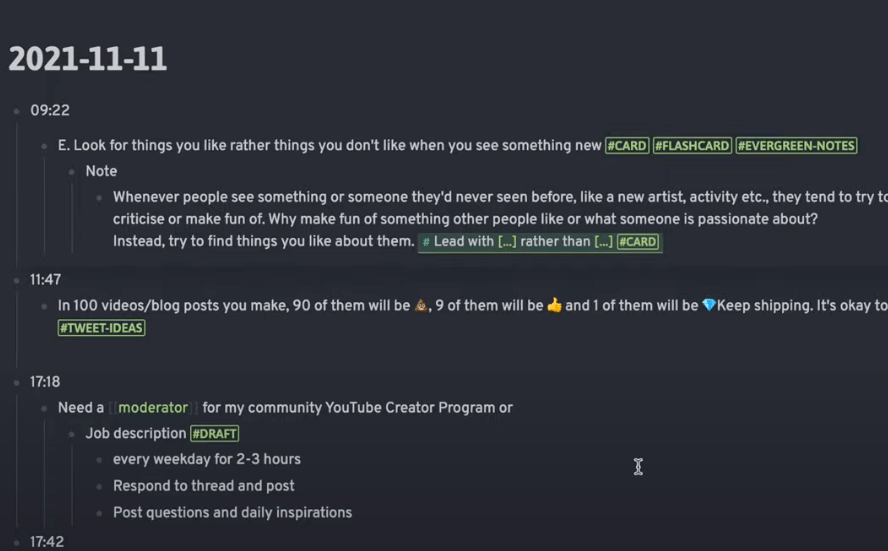

# [Zettelkasten: How to link and Organize notes (with 🎯 Hub Notes & Obsidian) - YouTube](https://www.youtube.com/watch?v=UaoWblf7cPo&list=PLK7WMaQudteWl8oH_WdPbEKgCS4t3Q5Rc) id=g13478

## s01: Önce keşif modunda (discovery) okumalar yap.

Bu moddayken aldığın notları günlük (journal) gibi bir log şeklinde tut.

Bir index (hub veya springboard veya map of content - moc) dosyası oluştur. 

Günlük loglarından bu indexe referanslar ver. 

## s02: Geliştirme (development) modunda notlarını topla.

Bu moddayken kendi düşüncelerini kendi cümlelerinle yaz.

Farklı farklı dosyalar oluştur. Bu dosyalardan, log dosyalarına istediğin gibi referans ver.

Hub dosyasından da bu kendi düşüncelerini yazdığın dosyalara referans ver.

Hub dosyasından çıkan bir linki takip et. Bu link zincirine, düşünce silsilesi (thought train) diyor.


## points

Etiketler: 

- `#hub`: index dosyası
- `#thought/0001`: düşünce silsileleri
- `#thought/0001/02`: düşünce silsilesindeki bir düşünce

# [Zettelkasten Smart Notes: Step by Step with Obsidian - YouTube](https://www.youtube.com/watch?v=ziE6UExsOrs&list=PLK7WMaQudteWl8oH_WdPbEKgCS4t3Q5Rc&index=2)

s01: Farklı türdeki notlar için farklı klasörler oluşturuyor:

- Fleeting Notes: hızlı notlar
- Literature Notes: okumalardan aldığımız notlar
- Permanent Notes: kalıcı kendi notlarımız

s02: Settings > Templates: Bir Templates klasörü oluştur

Farklı not türleri için standart şablonlarımız olacak.

Note Template:

```
# {{title}}
Created: {{date}} {{time}}

## References
1.
```

Map of Content Template:

```
# {{title}}
1.
```

s03: Her bir okuma için ayrı bir not dosyası oluştur Fleeting Notes altında

Bir okumayla ilgili tüm notlarını madde madde bu dosyaya koy.

s04: Literature Notes altında aynı başlıklı bir dosya oluştur

Özet aldığın notlar üzerinden kendi cümlelerini yaz.

s05: Permanent Notes altında bir MOC dosyası oluştur

Ana başlıkları linkler olarak yaz. 

# [How I Use Logseq to Take Notes and Organize My Life - YouTube](https://www.youtube.com/watch?v=BhHfF0P9A80) id=g13483

Timeline formatında yazıyor günlük notlarını: 



Bunun faydası, dosyalara başlık tanımlamak, onları klasörlere yerleştirmek gibi organizasyon işleriyle uğraşmaktan seni kurtarıyor.

Her şey zaman hattının bir parçası olduğundan, bilgilerin bağlamını hatırlamanı kolaylaştırır.

# [How to take smart notes - Shortform | Book](https://www.shortform.com/app/book/how-to-take-smart-notes) #ktp id=g13485

İş akışı (workflow) kısmını insanlar çoğunlukla atlıyorlar. Bu yüzden sistemden tam olarak faydalanamıyorlar.

## Slip-Box Sistemi Nasıl Çalışır?

### s01: Not al

3 tip not var: geçici (temporary, fleeting), literatür, kalıcı (evergreen, permanent)

s01a: Geçici notlar: Hızlı bir şekilde yaz ve unut. Inbox içinde topla.

s01b: Literatür notları: Önemli bir fikirle karşılaştığında bunları yaz. Bunları tepside (in-tray) topla.

Tam cümleler kur. Metni kendi ifadelerinle özetle.

Her bir notta tek bir fikir olmalı.

Her not içinde, kaynak materyale referans olmalı: Yazar, yıl, sayfa no.

[Literatür notları, okuduğun şeyle bağlantı kurmaya seni yönlendirir. Matushak](https://notes.andymatuschak.org/z3N113rxPFreW9xUkLkUFomr2LUqfXbdCo3M?stackedNotes=zg3fYweZpbHeBTpcYke5mF4ZfrJutYcQEtFo&stackedNotes=z6GNVv6RyFDewy11ZgXzce8agWxSLwJ6Ub5Rw)

s01c: Kalıcı notlar: Diğer notlarını birleştirerek bunları üretirsin.

Her gün tepsideki notların üzerinden geç. Şu soruyu kendine sor:

Bu fikirler başka hangi fikirlerle nasıl bir ilişki içindedir?

Bu ilişkilere dair önemli bir fikrin varsa, bunun için de ayrı bir not oluştur. Her özgün fikir için bir not olmalı.

Tam cümleler kur. Açık ve özlü yazmaya çalış. Atıf ver.

Bu kalıcı notlar, başka notlar olmadan, kendi başına anlamlı olmalı.

Kalıcı notları çıkarttıktan sonra, geçici notları çöpe atabilirsin.

[Matushak, bir notun bahsettiği kavramın bütününü içermesi gerektiğini söyler](https://notes.andymatuschak.org/z4Rrmh17vMBbauEGnFPTZSK3UmdsGExLRfZz1) Çok dar sınırlanmış notlar üzerinden faydalı bağlantılar kurmak zor olur. Tam tersine, çok geniş kapsamlı notlar da faydalı bağlantılar üretmez. Çünkü çok fazla yerle ilişkilenebilir.

### s02: Notları dosyalama (File notes)

Notları iki yerden birinde toplayacağız: ya bir referans sisteminde veya bir zettelkasten'da (slip-box).

a. Referans sistemi

Referans sistemi (indeks, hub veya map of content), literatür notlarını ve bunların bibliyografik kaynağını tutan bir not dosyası olacak.

b. Zettelkasten

Tüm kalıcı notlarını bu klasöre koyacaksın. Zaman sıralamasıyla sırala.

Notlarını tara ve bu yeni notlarla bağlantıları bulmaya çalış. Referansları iki yönlü olarak kaydet.

### s03: Indeksleme

Şimdi notlarını indekslemelisin. İki yolu var:

a. Bir anahtar kelimeye bağla, yeni kalıcı notları. 

İndekslemek için kullandığın anahtar kelimeler sadece senin için anlamlı olması yeterli. 

b. Mevcut kalıcı notlardan birisine bağla, yeni kalıcı notları.

### Arama bulma problemi

Belirli bir notu bulmak bu indeksleme ile çok kolay bir şey değil. Bu kasten yapılmış bir özellik. [Matuschak'ın notlarında da bunu görebilirsin](https://notes.andymatuschak.org/About_these_notes)

### s04: Fikir geliştirme

a01: Kutudaki notlarını gözden geçir. Bu sırada aklına yeni araştırma soruları gelecektir. 

Düzenli bir alışkanlık haline getir bu taramayı.

a02: Yeterince not biriktiğinde, bunları bir yayın haline getir.

Bu sırada eksik kalan bir yer olduğunu görürsen, bu soruyu da bir not haline getirip kalıcı notların içine ekle.

### s05: Yazma, düzeltme ve yayınlama

a01: Kaba bir taslak çıkart hızlı bir şekilde.

Stephen King, ilk taslağı hevesini koruyacak kadar hızlı yazmayı tavsiye eder.

- ## Zettelkasten sisteminin üstünlükleri
	id:: d7430c75-a0fd-45f5-bc81-5eed86f4b647

### p01: Düşünme sürecini tetikler

İnsanlar çoğu zaman bir şeyi yazmaya başladığında, onu etraflıca düşünmeye başlarlar. Zettelkasten yöntemi, bu etraflıca yazarak düşünme işini erkenden başlatır. 

Yazarlık engeli denilen başlama zorluğu, aslında bu düşünme sürecinin hep ertelenmiş olmasındandır.

#### q01: Yazarken düşünürsün

[Schopenhauer](https://www.cambridge.org/core/books/schopenhauer-parerga-and-paralipomena/4A6C077B1B797BDDE7FF75D75E531C21): Okurken düşünmek zorunda değilsindir, çünkü bu işi senin için yazar her türlü yapmıştır zaten.

#### q02: Yazdıkça beynindeki meşguliyetlerin azalır

Bir fikri etraflıca düşünüp yazınca, beynin başka problemlere artık kayabilir.

#### q03: Fikirlerin yazı haline gelince eleştirmen kolaylaşır

Fikirlerin somut ve belirgin bir hale gelir yazı haline geldiğinde. Bu yüzden bunlara eleştirel bir şekilde yaklaşman da kolaylaşır. 

### p02: Aşağıdan yukarı yaklaşımı

Yazarların çoğu yukarıdan aşağı gider. Halbuki insan normalde, bir miktar bilgi öğrenir. Bununla bir tahmini çıkarıma ulaşır. Daha sonra bunu destekleyecek araştırmayı yapar. Yani fikir geliştirmemizin sebebi, mevcut tezlerimizi destekleyebilmektir. Tersine yeni bir tez geliştirmek değil.

#### q01: Kaynak materyal bulma zorluğu

Yukarıdan aşağı yaklaşımda, kaynak materyali bulmak zordur. Zettelkasten yönteminde ise, zaten bilgiler ve kaynakları hazırdır. Tezin ve bunun argümanları organik bir şekilde yetişerek büyür.

Eğer kaynak materyalin yoksa, bu konuyla ilgili bir yayın yapmaya başlamazsın zaten.

#### q02: Confirmation yanlılığına düşersin

Yukarıdan aşağı yaklaşımda, iddianı doğrulayan argümanlara doğru yanlı olursun. Zıt bilgileri gözardı etmeye meylin olur.

#### q03: Sıkılma problemi

Bazen araştırma konunda sıkılabilirsin. Ama çok fazla yatırımın olduğu için başka bir alana çıkamazsın da. Ama Zettelkasten yönteminde zaten küçük parçalar halinde üretim yaptığın için çok daha erkenden yönünü belirleyebilirsin.

Ayrıca Zk yönteminde çok daha çeşitli konularla eş zamanlı olarak çalışabilirsin. Bu da sıkılmaya karşı bir önlem olur.

Farklı konularda çalışmak, insanın uzmanlık konusuna yeni bir perspektif getirmesine de yardımcı olur.

### p03: Yazma sürecini parçalarına böler

Geleneksel olarak insanlar okuma ve not alma yöntemleri arasında yöntemsiz bir şekilde gidip gelir. Zk yöntemi, okumadan yayın üretmeye kadar tüm süreci bir düzene sokar. 

### p04: Düzenli geribildirim sağlar

#### q01: Yazma sürecinin verimliliğini artırır

Eğer okuduğun metindeki fikirleri, kendi kelimelerinle özetleyemiyorsan, bu aslında konuyu tam anlamadığına dair bir geribildirimdir.

#### q02: Yazma becerilerini geliştirir

Düzenli olarak okumak, özetlemek ve yazmak, düşünme ve yazma becerilerini geliştirir.

Maksatlı egzersizin gerektirdiği koşulları da sağlarsın bu yolla: 

a. Hızlı geribildirim 

b. Her bir alt adımla ilgili belirli bir amaç

Örneğin: Okuma yaparken, literatür notları çıkarmaktır amacın. Analiz ederken, kalıcı notları çıkarmaktır amacın.

Ericsson'un maksatlı egzersiz (deliberate practice) kavramı, objektif bir ölçüm mekanizması gerektirir. Yazı yazmada objektiflik kriteri sağlanamayacağından, Ericsson'un bahsettiği anlamda maksatlı egzersizin bir örneği sayılmaz.

#### q03: İyi seçimler yapmana yardımcı olur

Hangi fikirleri takip etmelisin? Hangi kelimelerle bir fikri ifade etmelisin? Bu konularda iyi seçimler yapmana yardımcı olur.

En iyi yazarlar, yazma becerilerini sezgilerini takip ederek geliştirir. Bunu ise sık sık denemeler yaparak ve hatalarından öğrenerek yaparlar. Zk yöntemi sık sık deneme yapmanı sağlar. 

### p05: Beyninin çalışma şeklini taklit eder

Beyinde öğrenme, yeni bilgileri mevcut bilgilerle ilişkilendirerek gerçekleşir. Ne kadar çok bağlantı kurarsan, hatırlaman o kadar kolay olur.

Yaratıcılık ise, bilgileri daha önce kurulmamış şekilde birbiriyle ilişkilendirmekten geçer. Bunun içinse, belli bir konu üzerine çokça düşünmen gerekir. 

Aynı konuya uzun süre odaklanmış kişiler, aynı bağlantıları tekrarlamaya sıkışır. Bu yüzden Barbara Oakley "Learning How to Learn" kitabında, uzmanların düzenli olarak [yeni konular üzerine çalıştığını](https://shortform.com/app/book/learning-how-to-learn#diversify-your-studies) söyler.

Chris Bailey ["Hyperfocus"](https://shortform.com/app/book/hyperfocus) eserinde iki tür dikkat yönetiminden bahseder: hiper odaklanma (hyperfocus) ve dağılmış odaklanma (scatterfocus)

Hiper odaklanma sırasında, tek bir işe dikkatini yönlendirirsin. Zk ile notlarını doldurman bunu gerektirir.

Dağılmış odaklanma ise, zihnini dolaştırmayı (mind wandering) gerektirir. Zk yönteminde, notlar arasında bağlantı kurarken bunu yaparsın.


