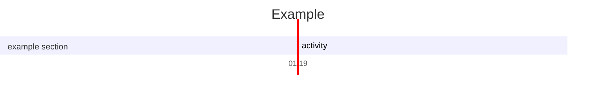
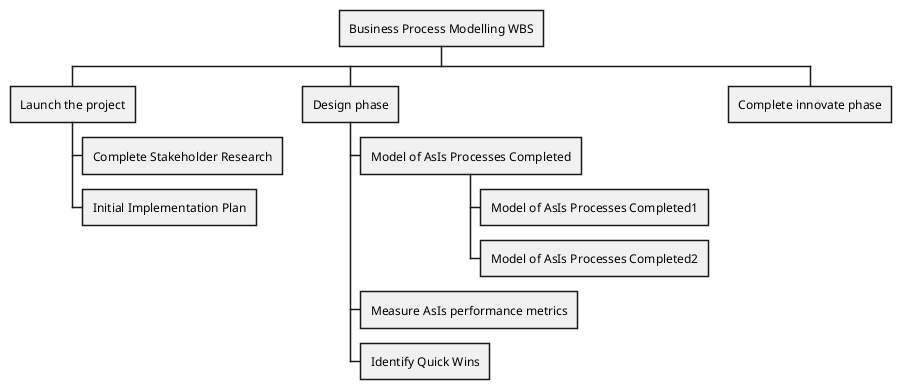
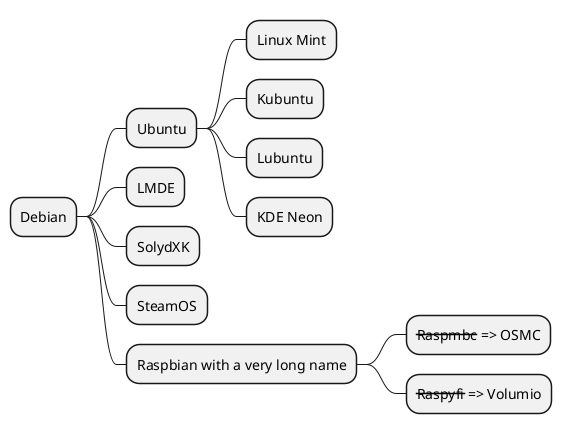
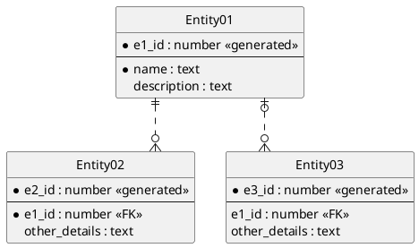
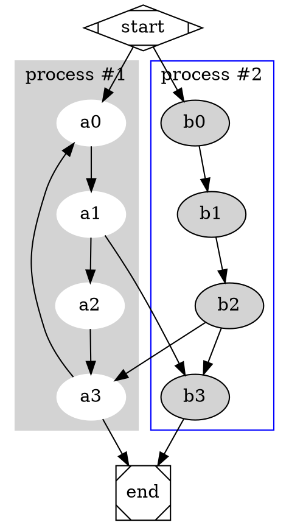

tags:: tpc/markdown, tpc/diagram, vim

# 20230303-MarkdownPreview-Diagram-PlantUML-Test id=g13811

rfr: [[20230321-markdown-it-Examples]] <url:file:///~/projects/study/logseq-study/pages/20230321-markdown-it-Examples.md#r=g14052>

${toc}

## Heading 1

## Heading 3

## Image Size


## PlantUML

```plantuml
Bob -> Alice : hello
```

## PlantUML Class

```plantuml
Class01 <|-- Class02
Class03 *-- Class04
Class05 o-- Class06
Class07 .. Class08
Class09 -- Class10
```

## PlantUML State

```plantuml
[*] --> State1
State1 --> [*]
State1 : this is a string
State1 : this is another string

State1 -> State2
State2 --> [*]
```

## PlantUML JSON

@startuml
json JSON {
   "fruit":"Apple",
   "size":"Large",
   "color": ["Red", "Green"]
}
@enduml

class diagram içinde Json kullanımı:

@startuml
class Class
object Object
json JSON {
   "fruit":"Apple",
   "size":"Large",
   "color": ["Red", "Green"]
}
@enduml

Complex example: with arrow

@startuml
allowmixing

agent Agent
stack {
  json "JSON_file.json" as J {
    "fruit":"Apple",
    "size":"Large",
    "color": ["Red", "Green"]
  }
}
database Database

Agent -> J
J -> Database
@enduml

## PlantUML Salt (Wireframe)

Mockup çizimleri için Salt:

@startuml
salt
{
  Just plain text
  [This is my button]
  ()  Unchecked radio
  (X) Checked radio
  []  Unchecked box
  [X] Checked box
  "Enter text here   "
  ^This is a droplist^
}
@enduml

## PlantUML Ditaa

Ditaa desteklenmiyor

## PlantUML Gantt



## PlantUML WBS



## PlantUML MindMap



## PlantUML ER



## Katex Latex


$\sqrt{3x-1}+(1+x)^2$

$$\begin{array}{c}

\nabla \times \vec{\mathbf{B}} -\, \frac1c\, \frac{\partial\vec{\mathbf{E}}}{\partial t} &
= \frac{4\pi}{c}\vec{\mathbf{j}}    \nabla \cdot \vec{\mathbf{E}} & = 4 \pi \rho \\

\nabla \times \vec{\mathbf{E}}\, +\, \frac1c\, \frac{\partial\vec{\mathbf{B}}}{\partial t} & = \vec{\mathbf{0}} \\

\nabla \cdot \vec{\mathbf{B}} & = 0

\end{array}$$


## mermaid:


js-sequence-diagrams:

``` sequence-diagrams
Andrew->China: Says
Note right of China: China thinks\nabout it
China-->Andrew: How are you?
Andrew->>China: I am good thanks!
```

## flowchart:

``` flowchart
st=>start: Start|past:>http://www.google.com[blank]
e=>end: End|future:>http://www.google.com
op1=>operation: My Operation|past
op2=>operation: Stuff|current
sub1=>subroutine: My Subroutine|invalid
cond=>condition: Yes
or No?|approved:>http://www.google.com
c2=>condition: Good idea|rejected
io=>inputoutput: catch something...|future

st->op1(right)->cond
cond(yes, right)->c2
cond(no)->sub1(left)->op1
c2(yes)->io->e
c2(no)->op2->e
```

## dot:



## chart:

``` chart
{
  "type": "pie",
  "data": {
    "labels": [
      "Red",
      "Blue",
      "Yellow"
    ],
    "datasets": [
      {
        "data": [
          300,
          50,
          100
        ],
        "backgroundColor": [
          "#FF6384",
          "#36A2EB",
          "#FFCE56"
        ],
        "hoverBackgroundColor": [
          "#FF6384",
          "#36A2EB",
          "#FFCE56"
        ]
      }
    ]
  },
  "options": {}
}
```

