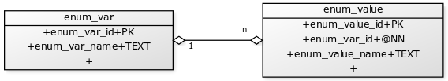

<style>
  .main-container {
    max-width: 1600px !important;
  }
</style>

``` {r set-options}
options(width = 150)
options(max.print = 30)
``` 

```{r}
library(dplyr, warn.conflicts = F)
data_model_dir = "/Users/mertnuhoglu/projects/itr/itr_documentation/data_model/"
```

[RDB](/tech/what_is_rdb/) is an abbreviation that I use for requirements database. I try to store all software specifications as structured data in a relational database format.

Here is an example data set for RDB:

``` {r}
den = tibble::tribble(
  ~data_entity_id,               ~entity_name,
               7L,               "enum_value",
               8L,                 "enum_var"
  )
dfl = tibble::tribble(
  ~data_field_id,         ~data_field_name,          ~type,     ~pk_fk, ~not_null, ~data_entity_id, ~fk_data_entity_id,     ~enum_var_name,
             26L,          "enum_value_id",          "INT",       "PK",     FALSE,              7L,                 NA,                 NA,
             27L,            "enum_var_id",          "INT",       "FK",      TRUE,              7L,                 8L,                 NA,
             28L,        "enum_value_name",         "TEXT",  "NON_KEY",     FALSE,              7L,                 NA,                 NA,
             29L,            "enum_var_id",          "INT",       "PK",     FALSE,              8L,                 NA,                 NA,
             30L,          "enum_var_name",         "TEXT",  "NON_KEY",     FALSE,              8L,                 NA,                 NA
  )
```

This data set stores metadata for two entities (tables): `enum_value` and `enum_var` 

This metadata actually describes attributes of these two entities. The UML diagram of these entities are as here:



My goal is to generate DDL (data definition language) statements for these entities given RDB metadata. So, at the end of the day I want to have the following lines:

``` sql
CREATE TABLE enum_value (enum_value_id BIGINT GENERATED BY DEFAULT AS IDENTITY PRIMARY KEY, enum_var_id BIGINT NOT NULL REFERENCES enum_var (enum_var_id), enum_value_name TEXT );
CREATE TABLE enum_var (enum_var_id BIGINT GENERATED BY DEFAULT AS IDENTITY PRIMARY KEY, enum_var_name TEXT );
``` 

I wrote a code generator in R to do this.

``` {r}
rdb_to_ddl = function(data_entity, data_field) {
  get_den_pk = function(den, dfl) {
    dfl_pk = dfl %>%
      dplyr::filter(pk_fk == "PK") %>%
      dplyr::select(-pk_fk) %>%
      dplyr::select(pk_data_field_id = data_field_id, fk_data_entity_id = data_entity_id, pk_data_field_name = data_field_name)
    den %>%
      dplyr::select(data_entity_id, entity_name) %>%
      dplyr::left_join( dfl_pk, by = c("data_entity_id" = "fk_data_entity_id")) %>%
      dplyr::select(data_entity_id, fk_data_entity_name = entity_name, fk_data_field_name = pk_data_field_name) 
  }
  get_dfl_fk = function(den, dfl) {
    dfl_fk = dfl %>%
      dplyr::filter(pk_fk == "FK") %>%
      dplyr::select(-pk_fk) %>%
      dplyr::left_join(get_den_pk(den, dfl), by = c("fk_data_entity_id" = "data_entity_id"))
  }
  den = data_entity 
  dfl = data_field 
  den_pk = get_den_pk(den, dfl)
  loop_create_table_sql = function(deid, dfl, den) {
    fd = dplyr::filter(dfl, data_entity_id == deid) %>%
      dplyr::left_join(den, by = "data_entity_id")
    table_name = unique(fd$entity_name)
    non_keys = dplyr::filter(fd, pk_fk == "NON_KEY")
    pks = dplyr::filter(fd, pk_fk == "PK")
    fks = dplyr::filter(fd, pk_fk == "FK") %>%
      dplyr::left_join(den_pk, by = c( "fk_data_entity_id" = "data_entity_id" ))
    tibble::tibble( 
                   data_entity_id = deid 
                   , sql_create_table = create_table_sql( table_name, non_keys, pks, fks )
                   )
  }
  ids = dplyr::distinct(dfl, data_entity_id)$data_entity_id
  lapply(ids, loop_create_table_sql, dfl, den) %>%
    dplyr::bind_rows()
}

create_table_sql = function(table_name, non_keys, pks, fks) {
  template_pk = "%s BIGINT GENERATED BY DEFAULT AS IDENTITY PRIMARY KEY"
  sql_pk = sprintf(template_pk, pks$data_field_name)
  template_fk = "%s BIGINT REFERENCES %s (%s)"
  sql_fk = sprintf(template_fk, fks$data_field_name, fks$fk_data_entity_name, fks$fk_data_field_name)
  template_nonkey = "%s %s"
  sql_nonkey = sprintf(template_nonkey, non_keys$data_field_name, non_keys$type)
  column_sql = c(sql_pk, sql_fk, sql_nonkey)
  column_names = column_sql %>% paste(collapse=", ")
	template = "CREATE TABLE %s (%s);"
	create_table = sprintf( template, table_name, column_names)
	return(create_table)
}
``` 

`rdb_to_ddl` function takes two `dataframe` inputs: `data_entity` and `data_field` and returns `DDL` statements of each entity defined in them.

``` {r}
ddl = rdb_to_ddl( data_entity = den, data_field = dfl)
ddl$sql_create_table
``` 

I want to add `NOT NULL` to this sql statement.

SQL statements are produced in `create_table_sql` function. Here, we have 3 different sql templates for 3 types of data fields, as follows:

``` r
create_table_sql = function(table_name, non_keys, pks, fks) {
  template_pk = "%s BIGINT GENERATED BY DEFAULT AS IDENTITY PRIMARY KEY"
  sql_pk = sprintf(template_pk, pks$data_field_name)
  template_fk = "%s BIGINT REFERENCES %s (%s)"
  sql_fk = sprintf(template_fk, fks$data_field_name, fks$fk_data_entity_name, fks$fk_data_field_name)
  template_nonkey = "%s %s"
  sql_nonkey = sprintf(template_nonkey, non_keys$data_field_name, non_keys$type)
  ...
``` 

`NOT NULL` idiom should be added to the sql templates of FK and non-key fields. 

``` {r}
create_table_sql = function(table_name, non_keys, pks, fks) {
  template_pk = "%s BIGINT GENERATED BY DEFAULT AS IDENTITY PRIMARY KEY"
  sql_pk = sprintf(template_pk
                   , pks$data_field_name
                   )
  template_fk = "%s BIGINT %s REFERENCES %s (%s)"
  sql_fk = sprintf(template_fk
                   , fks$data_field_name
                   , ifelse(fks$not_null == TRUE, "NOT NULL", "")
                   , fks$fk_data_entity_name
                   , fks$fk_data_field_name
                   )
  template_nonkey = "%s %s %s"
  sql_nonkey = sprintf(template_nonkey
                       , non_keys$data_field_name
                       , non_keys$type
                       , ifelse(non_keys$not_null == TRUE, "NOT NULL", "")
                       )
  column_sql = c(sql_pk, sql_fk, sql_nonkey)
  column_names = column_sql %>% paste(collapse=", ")
	template = "CREATE TABLE %s (%s);"
	create_table = sprintf( template, table_name, column_names)
	return(create_table)
}
```

Now, lets test this. First prepare the data to pass to `create_table_sql`

``` {r}
ddl = rdb_to_ddl( data_entity = den, data_field = dfl)
ddl$sql_create_table
``` 

The resulting sql contains `NOT NULL` as expected:

    enum_var_id BIGINT NOT NULL REFERENCES enum_var (enum_var_id),

